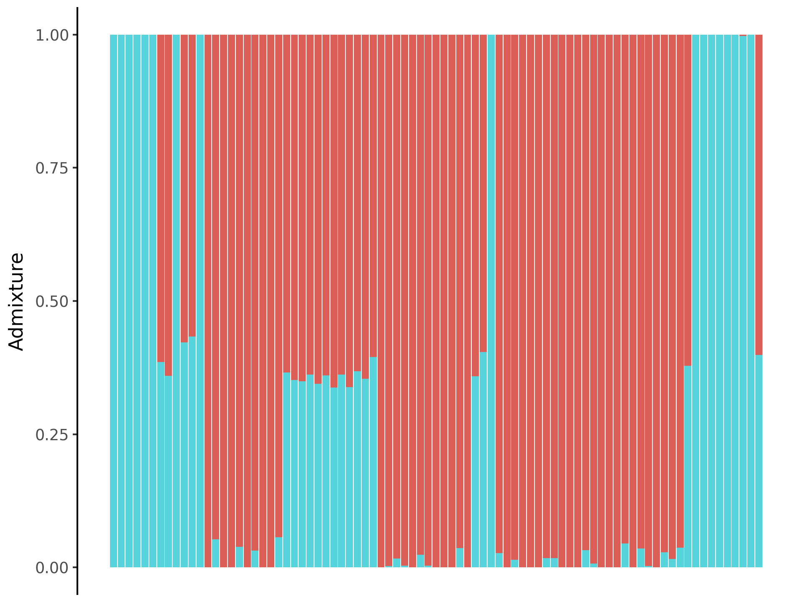

# nf-admix

Simple nextflow pipeline to run unsupervised [ADMIXTURE](https://dalexander.github.io/admixture) from a VCF file.
It is assumed that the input VCF has already been filtered, and that variants are not under Linkage Desequilibrium.


## Install

```bash
nextflow pull maxibor/nf-admix
```

## Run

```
nextflow run maxibor/nf-admix --vcf /path/to/vcf --k_min 3 --k_max 5
```

## Help

```
$ nextflow run maxibor/nf-admix --help
```

## Input/output options                                                                                                     
                                                                                                                            
Define where the pipeline should find input data and save output data.                                                      
                                                                                                                            
| Parameter | Description | Type | Default | Required | Hidden |                                                            
|-----------|-----------|-----------|-----------|-----------|-----------|                                                   
| `vcf` | Path to VCF file | `string` |  |  |  |                                                                            
| `k_min` | Minimum number of clusters | `integer` | 3 |  |  |                                                              
| `k_max` | Maximum number of clusters | `integer` | 5 |  |  |                                                              
| `best_n` | Plot best N ADMXITURE plots | `integer` | 2 |  |  |                                                              
| `outdir` | The output directory where the results will be saved. You have to use absolute paths to storage on Cloud       
infrastructure. | `string` | results | True |  |                                                                            
| `const_fid` | Set a constant plink family ID. <details><summary>Help</summary><small>Fixes multiple underscore issue in   
sample names when running unsupervised admixture. Set to other than 0 to activate</small></details>| `number` |  |  |  |                                                       
                                                                                                                            
## Other parameters                                                                                                         
                                                                                                                            
| Parameter | Description | Type | Default | Required | Hidden |                                                            
|-----------|-----------|-----------|-----------|-----------|-----------|                                                   
| `publish_dir_mode` |  | `string` | copy |  | True |                                                                       
| `custom_config_version` |  | `string` | master |  | True |                                                                
| `custom_config_base` |  | `string` | https://raw.githubusercontent.com/nf-core/configs/master |  | True |                 
                                                                                                                            


## Results

```bash
$ tree tests/results/
results/
├── admixture
│   ├── Pundamilia-2
│   │   ├── Pundamilia.2.log
│   │   ├── Pundamilia.2.P
│   │   ├── Pundamilia.2.Q
│   │   └── versions.yml
│   └── Pundamilia-3
│       ├── Pundamilia.3.log
│       ├── Pundamilia.3.P
│       ├── Pundamilia.3.Q
│       └── versions.yml
└── plot_admixture
    └── Pundamilia
        ├── Pundamilia_2_admixture.png
        ├── Pundamilia_2_admixture.svg
        ├── Pundamilia_3_admixture.png
        ├── Pundamilia_3_admixture.svg
        ├── Pundamilia_cv_error.png
        └── Pundamilia_cv_error.svg

5 directories, 14 files
```


Caption: Best ADMIXTURE plot, based on lowest cross validation error.

## Test

```
nextflow run maxibor/nf-admix -profile {docker,singularity,conda},test
```


## Acknowledgments
- This pipeline reimplements the example from the speciationgenomics ADMIXTURE tutorial: [speciationgenomics.github.io/ADMIXTURE](https://speciationgenomics.github.io/ADMIXTURE/)
- This pipeline uses [nf-core modules](https://nf-co.re/modules/)